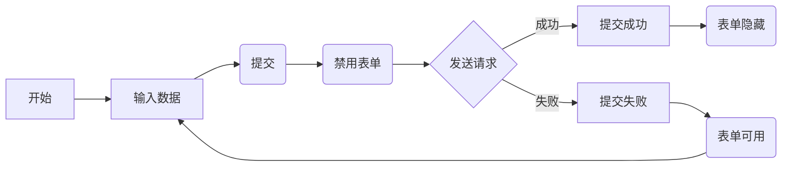

# 状态管理

## 用 State 响应输入

React 提供以声明式的方式来操作 UI。开发者无需直接操作 UI 的各个部分，而是描述组件可处于的不同状态，并根据用户输入在他们之间进行切换。

### 声明式 UI 与命令式 UI 的比较

* 当向表单输入数据时，“提交”按钮会随之变成可用状态
* 当点击“提交”后，表单和提交按钮都会随之变成不可用状态，并且会显示加载动画
* 如果网络请求成功，表单会随之隐藏，同时会显示“提交成功”信息
* 如果网络请求失败，错误信息回随之出现，同时表单变为可用状态

